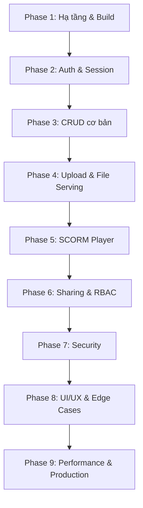
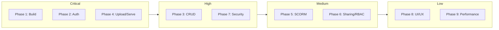

# Lộ trình Kiểm tra Toàn diện — Static Content Server

> Mục tiêu: Kiểm tra tất cả tính năng của hệ thống để đảm bảo mọi thứ hoạt động ổn định trước khi đưa vào production.

---

## Tổng quan Quy trình

---

## Phase 1: Hạ tầng & Build

| # | Kiểm tra | Cách thực hiện |
|---|----------|----------------|
| 1.1 | Docker MySQL khởi động thành công | `docker compose up -d mysql` → check healthcheck |
| 1.2 | Prisma migrate chạy không lỗi | `npx prisma migrate dev` |
| 1.3 | Seed data RBAC + test users | `npm run prisma:seed` |
| 1.4 | Build production thành công | `npm run build` — không có lỗi TypeScript/ESLint |
| 1.5 | Dev server chạy bình thường | `npm run dev` → truy cập http://localhost:3000 |
| 1.6 | Prisma Studio kết nối được DB | `npm run prisma:studio` |

---

## Phase 2: Authentication & Session

| # | Kiểm tra | Kết quả mong đợi |
|---|----------|-------------------|
| 2.1 | Đăng nhập với username + password đúng | Redirect về dashboard, session cookie được set |
| 2.2 | Đăng nhập với email + password đúng | Tương tự trên |
| 2.3 | Đăng nhập sai password | Hiển thị lỗi, không tạo session |
| 2.4 | Đăng nhập tài khoản DISABLED | Bị từ chối |
| 2.5 | Truy cập trang protected khi chưa login | Redirect về /login?redirect=... |
| 2.6 | API `/api/auth/me` trả đúng user info + CSRF token | JSON response hợp lệ |
| 2.7 | Logout xóa session | Redirect về login, không truy cập được trang protected |
| 2.8 | CSRF token validation | Request POST/PUT/DELETE không có CSRF → bị reject |

---

## Phase 3: CRUD cơ bản

### 3A. Project Management

| # | Kiểm tra | Kết quả mong đợi |
|---|----------|-------------------|
| 3A.1 | Tạo project mới | Project xuất hiện trong danh sách |
| 3A.2 | Tạo project trùng tên | Báo lỗi unique constraint |
| 3A.3 | Sửa project (tên, mô tả, trạng thái) | Cập nhật thành công |
| 3A.4 | Soft delete project | Project chuyển sang tab Đã xóa |
| 3A.5 | Restore project đã xóa mềm | Project quay lại tab Active |
| 3A.6 | Hard delete project | Xóa vĩnh viễn, không còn trong DB |
| 3A.7 | Tìm kiếm project theo tên/mô tả | Kết quả filter đúng với debounce |

### 3B. Module Management

| # | Kiểm tra | Kết quả mong đợi |
|---|----------|-------------------|
| 3B.1 | Tạo module trong project | Module xuất hiện trong danh sách |
| 3B.2 | Tạo module trùng tên trong cùng project | Báo lỗi |
| 3B.3 | Sửa module | Cập nhật thành công |
| 3B.4 | Soft delete module | Module ẩn khỏi danh sách active |
| 3B.5 | Restore module | Module quay lại |
| 3B.6 | Hard delete module | Xóa vĩnh viễn |
| 3B.7 | Hiển thị content count cho mỗi module | Số đúng |

### 3C. User Management

| # | Kiểm tra | Kết quả mong đợi |
|---|----------|-------------------|
| 3C.1 | Tạo user mới | User xuất hiện trong danh sách |
| 3C.2 | Tạo user trùng username/email | Báo lỗi |
| 3C.3 | Sửa thông tin user | Cập nhật thành công |
| 3C.4 | Toggle status ACTIVE ↔ DISABLED | Trạng thái thay đổi |
| 3C.5 | Reset password | Password mới hoạt động |
| 3C.6 | Gán/gỡ role cho user | Role cập nhật đúng |

---

## Phase 4: Upload & File Serving

| # | Kiểm tra | Kết quả mong đợi |
|---|----------|-------------------|
| 4.1 | Upload ZIP HTML package | Giải nén thành công, status COMPLETED |
| 4.2 | Upload ZIP SCORM package | Detect SCORM version, giải nén đúng |
| 4.3 | Upload file không phải ZIP | Báo lỗi validation |
| 4.4 | Upload file ZIP lớn (>100MB) | Xử lý được, progress cập nhật |
| 4.5 | Truy cập `/uploads/<path>/index.html` | Serve HTML đúng, no-cache headers |
| 4.6 | Truy cập `/uploads/<path>/` (directory) | Auto-serve index.html hoặc first HTML |
| 4.7 | Verify no-cache headers | Response có `Cache-Control: no-store, no-cache...` |
| 4.8 | Path traversal attack `../../../etc/passwd` | Bị block, trả 400 |
| 4.9 | Encoded traversal `%2e%2e` | Bị block bởi path.resolve check |
| 4.10 | Update file (thay thế ZIP mới) | File cũ bị xóa, file mới serve đúng |
| 4.11 | Download content | Tải ZIP về đúng |
| 4.12 | Streaming response cho file lớn | RAM không tăng đột biến |

---

## Phase 5: SCORM Player

| # | Kiểm tra | Kết quả mong đợi |
|---|----------|-------------------|
| 5.1 | Mở SCORM 1.2 package | Player load đúng, API wrapper hoạt động |
| 5.2 | Mở SCORM 2004 package | Player load đúng |
| 5.3 | SCORM manifest validation | Detect lỗi nếu manifest thiếu/sai |
| 5.4 | Launch file tự động từ manifest | Mở đúng file entry point |
| 5.5 | SCORM runtime communication | LMSInitialize, LMSGetValue, LMSSetValue hoạt động |

---

## Phase 6: Content Sharing & RBAC

### 6A. Content Sharing

| # | Kiểm tra | Kết quả mong đợi |
|---|----------|-------------------|
| 6A.1 | Share 1 content cho 1 user với canView | User được share thấy content |
| 6A.2 | Share với canDownload=true | User có thể download |
| 6A.3 | Share với canEdit=true | User có thể edit metadata |
| 6A.4 | Bulk share theo PROJECT scope | Tất cả content trong project được share |
| 6A.5 | Bulk share theo MODULE scope | Tất cả content trong module được share |
| 6A.6 | Revoke share | User không còn thấy content |
| 6A.7 | Content đã soft-delete không hiện cho shared user | Ẩn đúng |
| 6A.8 | Re-share (upsert permissions) | Quyền được cập nhật, không tạo duplicate |

### 6B. RBAC

| # | Kiểm tra | Kết quả mong đợi |
|---|----------|-------------------|
| 6B.1 | User với role ADMINISTRATOR | Có tất cả quyền |
| 6B.2 | User với role DEV | Chỉ có quyền theo config |
| 6B.3 | User với role TESTER | Quyền hạn chế |
| 6B.4 | MANAGE_OWN_CONTENT | Chỉ thấy/quản lý content của mình |
| 6B.5 | MANAGE_ALL_CONTENT | Thấy tất cả content |
| 6B.6 | Frontend PermissionGuard ẩn button | Button không hiện nếu thiếu quyền |
| 6B.7 | Backend permission check | API trả 403 nếu thiếu quyền |
| 6B.8 | Clone role | Role mới có cùng permissions |
| 6B.9 | Toggle role active/inactive | User mất quyền khi role bị disable |

---

## Phase 7: Security

| # | Kiểm tra | Kết quả mong đợi |
|---|----------|-------------------|
| 7.1 | CSRF protection trên tất cả mutation APIs | Request không có token → 403 |
| 7.2 | Session expiry | Session hết hạn → redirect login |
| 7.3 | Path traversal trên uploads route | Bị block |
| 7.4 | XSS trong tên project/module/content | Input được sanitize |
| 7.5 | SQL injection qua search params | Prisma parameterized queries chặn |
| 7.6 | Truy cập API protected không có session | 401/redirect |
| 7.7 | CORS headers trên /uploads | `Access-Control-Allow-Origin: *` |
| 7.8 | X-Frame-Options cho uploads | Cho phép embed (ALLOWALL removed) |
| 7.9 | File name sanitization | Tên file tiếng Việt/ký tự đặc biệt được normalize |

---

## Phase 8: UI/UX & Edge Cases

| # | Kiểm tra | Kết quả mong đợi |
|---|----------|-------------------|
| 8.1 | Responsive layout (mobile/tablet/desktop) | Grid chuyển 1→2→3 cột đúng |
| 8.2 | Loading states | Skeleton/spinner hiện khi fetch data |
| 8.3 | Error states | Toast/alert hiện khi có lỗi |
| 8.4 | Empty states | Hiện message khi không có data |
| 8.5 | Pagination | Chuyển trang đúng, data load đúng |
| 8.6 | Bulk delete content | Chọn nhiều → xóa hàng loạt thành công |
| 8.7 | Import content | Import từ file thành công |
| 8.8 | Content versioning | Tạo version mới, restore version cũ |
| 8.9 | SSE real-time updates | Content status cập nhật real-time |
| 8.10 | Dashboard stats chính xác | Số liệu khớp với DB |

---

## Phase 9: Performance & Production Readiness

| # | Kiểm tra | Kết quả mong đợi |
|---|----------|-------------------|
| 9.1 | Build production không warning nghiêm trọng | `npm run build` clean |
| 9.2 | Standalone output hoạt động | Chạy được từ `.next/standalone` |
| 9.3 | File streaming không leak memory | Upload/serve file lớn ổn định |
| 9.4 | Database connection pooling | Không bị connection exhaustion |
| 9.5 | Concurrent uploads | Nhiều user upload cùng lúc không conflict |
| 9.6 | CDN cache headers đúng | Cloudflare/CDN không cache uploads |
| 9.7 | Docker deployment | Build image + run container thành công |

---

## Thứ tự ưu tiên thực hiện

---

## Công cụ kiểm tra đề xuất

| Loại | Công cụ |
|------|---------|
| API Testing | Playwright API testing hoặc curl scripts |
| E2E Testing | Playwright (đã có trong devDependencies) |
| Manual Testing | Browser DevTools (Network tab cho cache headers) |
| Security | OWASP ZAP hoặc manual penetration testing |
| Performance | `autocannon` hoặc `k6` cho load testing |
| Database | Prisma Studio để verify data |

---

## Ghi chú

- Dự án đã có `@playwright/test` trong devDependencies → nên viết E2E tests
- Mỗi phase nên test trên cả dev mode (`npm run dev`) và production build (`npm run build && npm start`)
- Kiểm tra cache headers bằng `curl -I http://localhost:3000/uploads/...`
- Với SCORM, cần có sample packages SCORM 1.2 và 2004 để test
